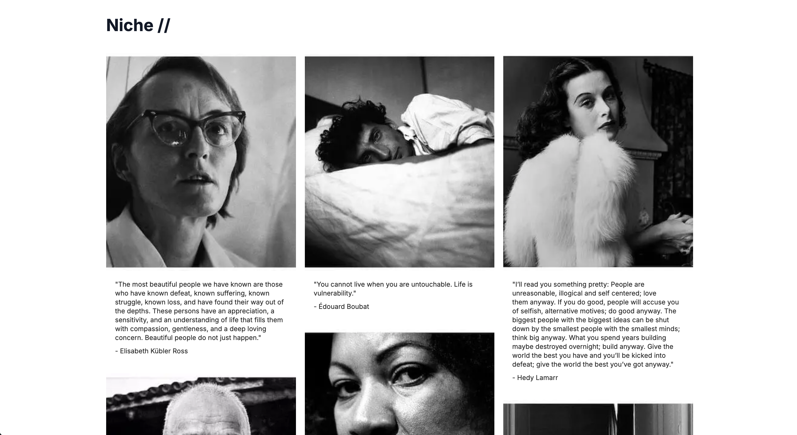

Niche is a simple web app for browsing and discovering quotes. The interface is clean and responsive, with a masonry grid layout for displaying quote cards. You can scroll to load more quotes and view them in a visually appealing way.

- Built with Next.js and TypeScript
- Uses Tailwind CSS for styling
- Quotes are loaded and paginated from a local JSON file
- Responsive design with support for dark mode

Source: [github.com/pappater/niche](https://github.com/pappater/niche)

